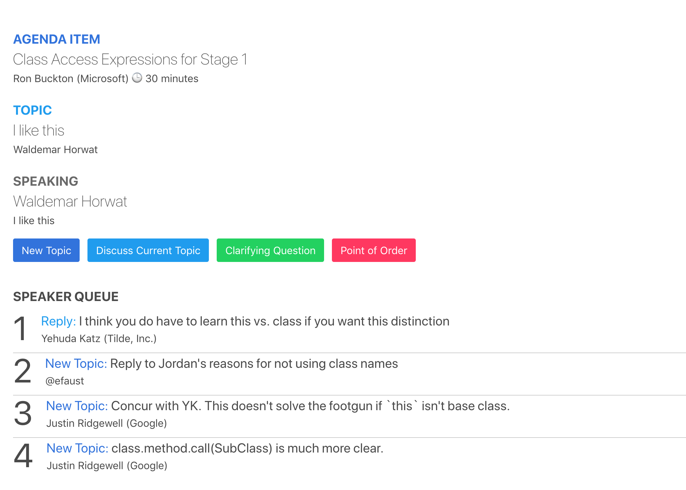

# How to participate in meetings

TC39 meetings can get quite large. Sometimes we can have more than 60 people in a room, plus people
joining in remotely. Because of this, we have some practices put in place to make things more
manageable, and make it possible for everyone to be heard!

## Guidelines

We have a [Code of Conduct](https://tc39.es/code-of-conduct/). Please read through the CoC
and remember to be respectful and considerate when participating in meetings. It is key that we keep
our discussion friendly, patient, and considerate as we are discussing proposals.

## Consensus

The committee operates using a model of complete consensus. This means that everyone has to agree in
order for a proposal to move forward in the stages. This is something that the committee feels
strongly about, and in past cases a single person disagreeing with a proposal has helped us rework
and improve proposals rather than letting them through to the next stage. As such, breaking with
consensus can be very disruptive and shouldn't be done unless necessary. For this reason you will
often see delegates say that they might not like a solution very much, but will not break consensus
unless other delegates are also not happy with a solution. Breaking consensus alone is a very strong
signal.

If you find that you are unhappy with a proposal, try to think of a way to help the proposal address the
issues you see with it, and articulate them. What are the limitations? Are there studies that the
champions can do to help their case? What sort of improvements are needed? Have requirements been
missed? Try to move the discussion in a positive direction!

### Procedure for establishing consensus

Committee consensus is required to advance a proposal to a subsequent stage and to merge normative PRs. To achieve consensus in committee, take the following steps:
1. Place the item, with a link to the detailed materials, on the TC39 agenda ahead of the agenda deadline.  This is to ensure everyone has a chance to review it ahead of the meeting, and insert schedule constraints for when they want to participate in the discussion. Note that some schedule constraints may force the topic into a future meeting.
1. Discuss it at the meeting in a presentation, hearing out all concerns from the committee. If there is too much to discuss to fit within the timebox, then rather than jumping to asking for consensus, prefer to continue discussion in an overflow item or future meeting.
1. When discussion has concluded, a call for consensus can be made, as follows:
    1. The presenter asks the committee for consensus on $xyz.
         1. (Note, the chair may encourage the presenter to make this request if it appears that the committee conversation has settled, or the presenter may decide to ask this directly.)
    1. One TC39 attendee states, “I nominate $xyz for consensus.”
    1. Another states, “I second $xyz for consensus.”
    1. The chair will then ask the committee, “Does anyone object to $xyz for consensus?”
    1. If there are no objections, the chair states, “$xyz has achieved consensus”.
    1. This result is recorded in the minutes and reviewed by the proposer. This is perhaps the most important part. Note that the consensus may come with certain “strings attached”, e.g., certain edits made. This is known as “conditional consensus” and must be fully recorded in the minutes as well.

If a proposition does not reach consensus, note that the committee may revisit it at any time in the future, given that this procedure is followed appropriately. At the same time, once the committee has reached consensus on a proposition, it is considered to have established the consensus, and it would take consensus in a different direction to change course. For example, advancing a proposal to a further stage requires consensus, as does retracting it to the previous stage–a single objection is not enough to undo consensus after it is established.

Objections to consensus need to be accompanied by a rationale which is appropriately related to the proposition under consideration. For example, for stage advancement, an objection must relate to the qualifications/maturity/acceptance criteria of that stage. It is not meaningful to “object” to established consensus (e.g., around prior stage advancement), as it would take a new consensus decision to overturn it.

The only exception where consensus may be “undone” soon after it was made is due to inappropriate exclusion of someone from the discussion, e.g., if the item hadn’t been placed on the agenda by the deadline, leading a delegate to not attend a meeting where they would have objected to the consensus.  Self-exclusion does not qualify, e.g. people choosing not to attend or not reading the agenda ahead of time.

The process to achieve consensus requires explicit support from two attendees besides the presenter. This requirement exists to ensure that there is active support in committee from the proposal aside from the champion, rather than simply a lack of explicit objections.

## Tools for participation

We have a few tools that help us facilitate communication. They are as follows:

### Matrix

_Purpose_: A place for delegates to ask questions in a non vocal manner, useful if you need
definitions or something similar!

_How to use_:

We use the #tc39-delegates channel on Matrix during the meetings. This channel
is open to delegates. The public channel #tc39-general is useful for outside
communication that is _not_ during meetings. You can find instructions for
joining [here](matrix-guide.md).

### [Queue](https://tcq.app/)

_Purpose_: To organize people's responses to a topic, and make sure everyone is heard.

_How to use_:

When the meeting starts, a link to the tcq meeting will be added to the delegates Matrix channel topic.
At the top you will see "Agenda" and "Queue".

These links (and more helpful information) are also available on the pinned Reflector issue for the given plenary.

If you are interested in knowing what is coming up, you can take a look at the agenda page. However
this is more useful for chairs, who can add agenda topics that are coming up next, and their
associated time box.

During presentations, if you notice something a speaker says that you want a clarification of, or to
make a comment, you can do this in the queue. There are three options: new topic, clarifying
question, and point of order. It looks something like this:

At the top we have the agenda item that is being discussed, followed by the queue item that is being
discussed. After that, we have a bunch of buttons!

If you are speaking, then you will also have the option to say that you are done speaking.

As for the other four buttons!

A new topic breaks with the current topic, and starts a new thread to which clarifying questions
might be added. New topics are ordered by when they are added to the queue.

To discuss current topic is to reply to it. If you reply to the current topic, it will go
immediately after the current speaker / any other replies that came before yours.

A clarifying question is used when you want to continue the current topic and ask something about
it. For example, if someone uses an example that doesn't make sense to you, you can ask them to
clarify what they meant. Clarifying questions will be added in the order they were entered into the
queue.

A point of order is used to immediately bring up a point. For example, if a note taker
has been kicked from the notepad, and needs people to pause for a moment, they might use a point of
order, saying that the note taking service is down. This is added to the top of the queue, and will
be the next thing addressed.

### [Timebox](https://timebox.now.sh/)

_Purpose_: To ensure that topics discussed on the agenda are timeboxed and that we do not go over time talking about a
subject. It is enforced by the chair group.

_How to use_:

The timebox is used primarily to make sure we are on time with our topic. You can visit this page if
you want to see how much time is left for a topic. If we go over time, let us know so that we can
vote on if a topic needs more time!

### [Google docs](https://www.google.com/docs/about/)

_Purpose_: To record the meeting so that it can be shared with the public, and referenced in the
future.

_How to use_:

**Please remember: Never share this link publicly.**

For every day of the meeting we have a new Google Docs URL that is shared in the delegates Matrix channel.

Everyone is encouraged to help taking notes, and this is a good way to get involved if you are new.
For more information, please take a look at our [how to be a note taker](./how-to-take-notes.md) documentation.

### Google Hangouts and other remote call technology

_Purpose_: To allow remote TC39 delegates to participate in the meeting.

_How to use_:

We use Jitsi (hosted on [8x8](https://8x8.vc)) to facilitate remote attendance, unless another solution is deemed a better
fit for the situation. The link will be posted on a meeting by meeting basis. To attend, use the link posted at the top of
the delegates Matrix channel.

## Tips

- If you are new and not sure what to do, consider becoming a note taker!
- Talk to people during the meetings, they can help you establish context for anything that seems
  strange.
