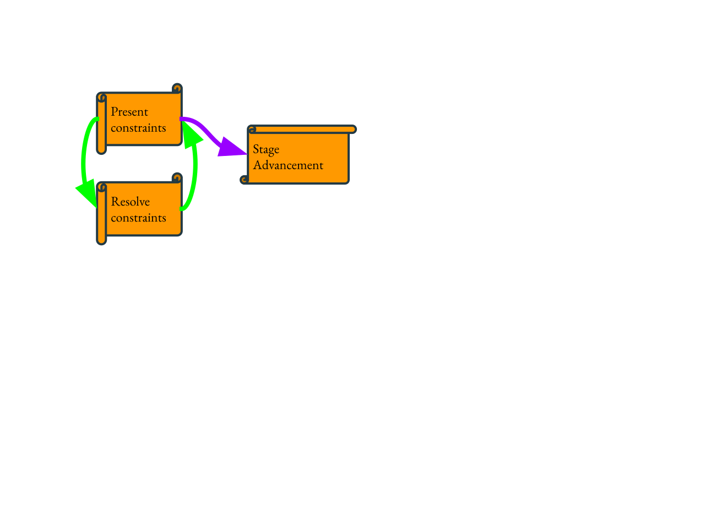

# TC39 Incubator Call Participation Guidelines

A model of the TC39 working mode is this flowchart:

Incubator calls seek to speed up the process by having a sanctioned bi-weekly
timeslot for stakeholders to present constraints. The general guiding principle
of the incubator calls is:

  <i>To present and receive feedback that is relevant for eventual stage advancement.</i>

The incubator calls should be a low-stakes environment. While stage advancement
remains the eventual goal, the call is a venue to keep engaged and discuss
issues without feeling the pressure to drive or to block consensus.

## Participant Categories

- _Champions_ are those in the champion group of a particular proposal.
- _Core stakeholders_ are those who have feedback and have committed time to resolving constraints with the champions
- _Contributors_ are those who have feedback but have not committed time to resolving constraints with the champions
- _Facilitators_ are those running the incubator calls and is orthogonal to the other categories

## Before the Call: Setting the Agenda

To focus on the guiding principle of providing and receiving relevant feedback, the agenda items should be scoped. Open ended calls for feedback are discouraged.

### Champions

Champions should set the initial agenda by adding concrete and scoped discussion
items to the agenda. Where there is existing discussion in e.g. a GitHub issue,
that should be linked. Where there is no existing discussion, a short summary
should be made available, usually in the form of a GitHub issue or PR. Champions
are free, but not obligated and not necessarily encouraged, to make slides.

Champions should be explicit about any topics that they deem out of scope. These
may be anything at the champions’ discretion. They may include controversial
topics that have been discussed at length and that have been decided already in
committee, would not benefit from further feedback, or are inactionable.

This should be done no later than 7 days before the call.

Examples of bullet points to include on an agenda:
- Request for feedback: FinalizationRegistry API change to per-item callback ([proposal-weakrefs#155](https://github.com/tc39/proposal-weakrefs/issues/155))
- Request for feedback: How should we rename FinalizationGroup ([proposal-weakrefs#180](https://github.com/tc39/proposal-weakrefs/issues/180))
- Out of scope: whether we should make GC observable (prior resolution: it is OK that WeakRefs make GC observable)

### Core stakeholders

It is a goal of incubator group calls to bring core stakeholders together
outside of TC39 meetings. We won't always be able to get everyone's attention,
but when we can achieve this goal, we can make further progress in moving
proposals forward.

Core stakeholders should review the agenda 7 days before the call and
familiarize themselves with any materials the champions have made available.

Core stakeholders should add feedback they would like to either present or
request from other participants.

In alignment with the guiding principle, core stakeholders should prioritize
giving feedback that they feel would slow down or endanger eventual stage
advancement. That said, the usual guidelines about feedback apply: the feedback
should be actionable and there should be novel information available.

Core stakeholders should challenge out-of-scope limitations if they
disagree. This can be done out-of-band or on the GitHub thread.

Example feedback to add to the agenda ahead of the meeting:
- Feedback (from <NAME>): FinalizationRegistry should allow users to express backpressure.

Note that core stakeholders and other participants are always welcome to give
additional feedback in meetings, as long as it's in scope for the discussion. We
want to collect feedback early and often!

### Contributors

Contributors have the right but not the obligation to add feedback items to the agenda.

They are not obligated, unlike core stakeholders, to do any homework. However,
incubation calls are meant to facilitate feedback. Because time itself during
the meeting is limited, if a particular topic looks of interest to a
contributor, and they would like to contribute feedback, the facilitators
encourage contributors to page some context in.

To constructively enable the meeting contributors to have the appropriate
context, topics and related resources are placed on the agenda, for all
participants to read ahead of the meeting. Additionally, participants are
actively encouraged to ask true clarifying questions, more than in a normal TC39
meeting. For example, "how does this part work?" or "what do you mean by that
term?". These questions are very useful to champions in refining how they
present proposals.

### Facilitators

4 days before the call, facilitators will go through the agenda and make a
judgment call on what to discuss at the next call. Overflow will be pushed to
the next meeting.

### No FOMO

Participants should feel empowered to skip a call if no agenda items of interest
to them are present 4 days before the call. Also remember that no binding
decisions are made in incubator calls. Consensus decisions are made in TC39
meetings.

Facilitators will conclude the call early instead of using additional time for
impromptu topics, in case those topics are of interest to participants who
decided to skip. Instead, impromptu topics will be put on the agenda for future
calls.

## During the Call

During the call, the agenda items will be processed in order. Unlike plenary,
there are no hard timeboxes. Instead, the facilitators and champions may ask to
move on to the next topic at their discretion. Discussions are facilitated by
TCQ, like in plenary. Notes are taken, like in plenary.

Meeting facilitators are specifically empowered to keep the discussion within
the scope of the current agenda item. For example, if we're talking about one
area of concern, and participants bring up another, facilitators may decide to
queue that new area to be discussed later in the meeting. Or, if participants
bring up an explicitly out-of-scope item, the facilitators may remind
participants about the meeting scope.

General timeline:
1. Quick introduction
1. Adopting the agenda
1. Agenda items
1. Heads up announcements for next call

For each agenda item:
1. Participant provide ~5 min intro and context-setting
1. Discussion
1. Identify action items for champions and core stakeholders, such as following up on a thread

Remember, the guiding principle is to present and receive relevant feedback in a
more timely manner. When in doubt, yield time to other participants to present
their feedback instead of attempting to resolve the feedback in the
moment. Resolving the issue should ideally be done asynchronously, or in plenary
itself, if particularly controversial.

# After the Call

Participants are encouraged to review the notes, which will be published 7 days
after the meeting.
